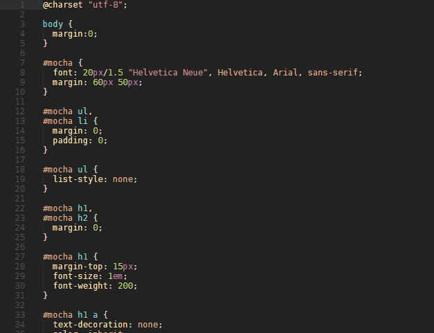

# README

## Nightshade Theme

A dark theme with medium contrast and color intensity.

## Examples

### HTML

### CSS

### Javascript

### C++

### Markdown

### Shell Script

### Python

## Repository

[GitHub repository][repository]

[repository]: https://github.com/rbolsius/vscode-theme-nightshade
